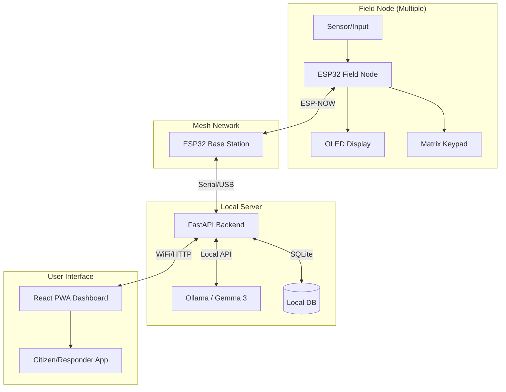

# Sahayak System Architecture

This document details the technical flow and structure of the Sahayak disaster response system.

## High-Level System Flow

The system operates in three main tiers: The Mesh Layer (Hardware), the Intelligence Layer (Backend), and the Presentation Layer (Frontend).

## Data Propagation Flow

When an alert is triggered from the field:

1.  **Trigger**: A user enters a code on the Matrix Keypad (e.g., `1` for Medical) or sends a message via the PWA connected to a node.
2.  **Mesh Routing**: The message hops across Field Nodes using the ESP-NOW protocol until it reaches the **Base Station**.
3.  **Local Processing**: The Base Station forwards the data via Serial to the **FastAPI Backend**.
4.  **AI Analysis**: The Backend queries the **Gemma 3 LLM** (running locally via Ollama) to generate a response based on NDMA protocols.
5.  **Feedback Loop**: The response is saved to the local SQLite DB and broadcast back through the mesh to the originating node's OLED and the PWA dashboard.

## Resilience Features

-   **Offline-First**: No internet required at any stage.
-   **Self-Healing**: Nodes automatically find the best path to the base station.
-   **PWA Persistence**: The frontend works as a standalone app on smartphones, caching data via service workers.
-   **Hardware Fallback**: If a smartphone is unavailable, the node's OLED and Keypad provide a direct interface for emergency alerts.
